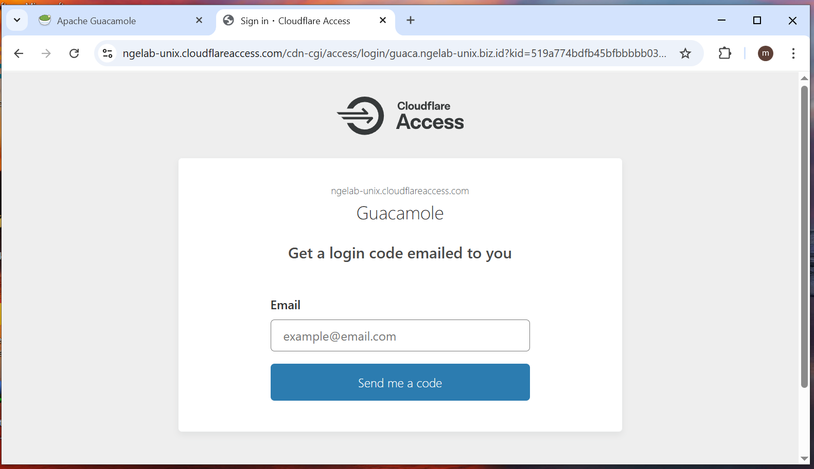
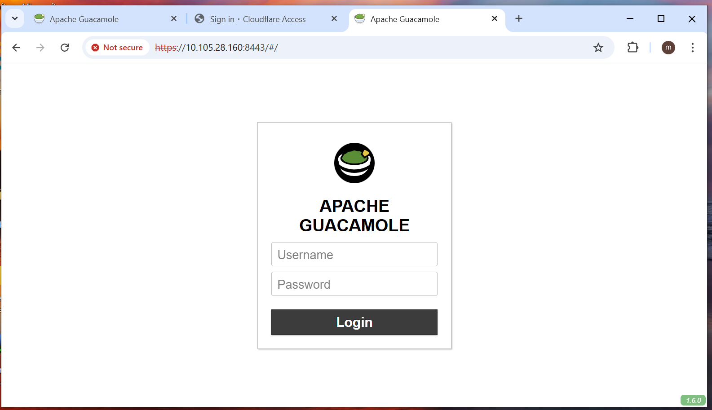

# Remote Office Access Lab with Apache Guacamole + Cloudflare Tunnel + Domain

## TUJUAN
Membangun simulasi remote access kantor menggunakan:
- **Apache Guacamole + TOTP** untuk akses desktop/server via web
- **TOTP + Google Authentifikator** sebagai lapisan keamanan kedua dalam proses autentikasi dua langkah (2FA)
- **Cloudflare Tunnel** untuk publikasi tanpa IP publik
- **Domain** untuk mempermudah mengakses server via web
- **Tomcat** sebagai terminator SSL (opsional)
- **Canonical/LXD** untuk isolasi environment

## Fitur
- Akses remote desktop via web (RDP, SSH, VNC)
- Integrasi domain dengan Cloudflare
- Akses aman tanpa IP publik

## 📊 Diagram Topologi

## 📷 Screenshot 
 
## Catatan
- Tested on Debian 12 LXD container
- Bisa diadaptasi untuk production dengan server fisik/vm

-------------------------------------------------------------------------------------------------------------
## 👤 Author
Aditya Ramadhani – [LinkedIn](https://linkedin.com/in/username) | [Email](mailto:ramadhaniaditya19@gmail.com)
-------------------------------------------------------------------------------------------------------------
